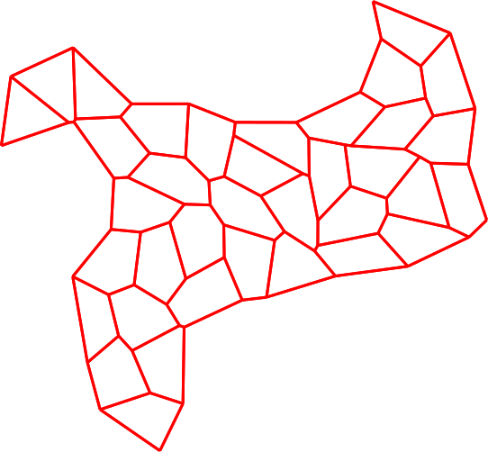

# Cells

Python3 library written in C++ to integrate vertex models.



This readme assumes that `python` is the Python3 command.

## Installing

**PLEASE READ THIS SECTION ENTIRELY BEFORE EXECUTING ANY COMMAND.**

### Using `pip`

This requires C++20 compiler and [`eigen3`](https://eigen.tuxfamily.org/index.php).

Configuration file `pyproject.toml` defines instructions to install the `cells` package using `pip`. This is achieved by executing *from the directory containing this readme file* the following commands
```sh
[ -f README.md ] && python -m pip install . --verbose --break-system-packages
```
then -- after successful completion -- package information should be given by `python -m pip show cells`.

Package `cells` can be uninstalled by running `python -m pip uninstall cells --break-system-packages`.

Replacing `install` with `install --editable` will enable [editable mode](https://setuptools.pypa.io/en/latest/userguide/development_mode.html), in this case the libraries must be manually compiled (see section below).

### Compiling manually and adding to `$PYTHONPATH`

This requires a C++20 compiler and [`eigen3`](https://eigen.tuxfamily.org/index.php), as well as `pybind11` (`python -m pip install -r requirements.txt --break-system-packages`).

Makefile `src/cells/Makefile` defines instructions to build the libraries. Compilation is achieved by executing *from the directory containing this readme file* the following commands
```sh
[ -f README.md ] && (cd src/cells && make)
```
then -- after successful completion -- the shared library path should be given by `[ -f README.md ] && python -c "from src.cells import bind; print(bind.__file__)"`.

Addition of the `cells` package to the `$PYTHONPATH` is achieved by executing *from the directory containing this readme file* the following commands
```sh
[ -f README.md ] && echo "export PYTHONPATH=\$PYTHONPATH:${PWD}/src" >> ~/.${0}rc && source ~/.${0}rc
```
then -- after successful completion -- the module path should be given by `python -c "import cells; print(cells.__path__)"`.

Addition to the `$PYTHONPATH` in the shell configuration file can be reverted by executing
```sh
[ -f README.md ] && sed -i '/'"export PYTHONPATH=\$PYTHONPATH:${PWD//'/'/'\/'}"'\/src/d' ~/.${0}rc
```
even though it is preferable to perform this operation manually (e.g. `vim + ~/.${0}rc`).

### Building a `singularity` container

This requires [`singularity`](https://docs.sylabs.io/guides/latest/user-guide/) and admin (`sudo`) privilege.

Configuration file `container.def` and makefile `container.makefile` define instructions to build the container. This is achieved by executing *from the directory containing this readme file* the following command
```sh
[ -f README.md ] && make -f container.makefile
```
then -- after successful completion -- package information should be given by `./container.sif python -m pip show cells`.

This operation is reverted by `[ -f README.md ] && rm -iv container.sif`

Note that package `cells` is then available through the `python` interpreter of the container with `./container.sif python -m cells` or `singularity exec container.sif python -m cells`.

### Installing `eigen3`

Library [`eigen3`](https://eigen.tuxfamily.org/index.php) should preferably be installed through your distribution package manager (e.g. `sudo apt install libeigen3-dev` on Debian Linux), or through environment modules (e.g. check it is available with `module avail eigen` then load it with `module load ...`).

It is also possible to clone the library by executing *from the directory containing this readme file* the following commands
```sh
[ -f README.md ] && git clone https://gitlab.com/libeigen/eigen.git src/cells/extern/eigen && ln -s eigen/Eigen src/cells/extern
```
then -- after succesful completion -- the library header files should be given by `ls src/cells/Eigen`.

## Running

After installation, use `python -c "import cells; print(cells.__path__)"` to find the location of the package files.

Python routines `read.py`, `run.py` and `vm.py` require `numpy` and `matplotlib` (`python -m pip install -r requirements.txt --break-system-packages`).

### Routines and modules

There are two default routines to simulate vertex models: `run.py` runs and plots in real time a simulation of a vertex model, and `vm.py` runs and saves a simulation of a vertex model. These routines rely on modules `init.py`, `plot.py` and `read.py`.

Module `init.py` defines functions to parse command line arguments and initialise vertex models as function of these arguments. A list of these arguments can be displayed with `python -m cells.run -h` and `python -m cells.vm -h`.

Module `plot.py` defines functions to plot vertex models.

Module `read.py` defines objects and functions to access and plot vertex model data. Executed as a routine (`python -m cells.read`) , with a simulation file name as a command line argument, this prints `true` (respectively `false`) if the file is consistent (respectively not consistent).

### Additional scripts

Script `movie.sh` is a quick tool to make movies and requires `plot.py`, `read.py`, and [`ffmpeg`](https://ffmpeg.org/download.html). Calling module `run.py` with command line argument `-m` (or `-movie`) will save displayed frames and make a movie from these frames when exited.

### Examples

```sh
python -m cells.run -abp -area -perimeter
python -m cells.run -abp -area -perimeter -forces
python -m cells.run -abp -area -perimeter -forces -m
python -m cells.run -out -area -periodic -N 12
```

## C++ source files

These are located in `src/cells`.

### Vertex model

This vertex model implementation is separated in two parts. First `mesh.*pp` contains the implementation of the geometrical features of the model, which relies on vertices which are linked together by directed half-edges enabling to move across the mesh (see `docs/mesh.pdf`). Second `system.*pp` provides a general `VertexModel` class to integrate the dynamics.

`VertexModel` methods to initialise configurations are defined in `initialisation.cpp`.

### Python binding

`VertexModel` is exposed to Python through `pybind11` in `bind.cpp`. Importantly, this file also contains additional methods to provide control of the forces and faster access to information within `VertexModel` in Python.

### Forces

Forces are defined separately and are attached to the `VertexModel` class following a class factory method (see `class_factory.hpp`) which enables to add and remove different forces. There are two general classes of forces enabled (see `base_forces.hpp`): forces which are computed for all vertices of a given type (`VertexForce` class), and forces which are computed for all half-edges of a given type (`HalfEdgeForce` class).

Definitions of forces belong in `forces.hpp`. Script `forces.cpp` provides definitions of `VertexModel` methods to add them to the simulation object. Header `forces_pickle.hpp` provides definitions of own and `VertexModel` methods to pickle and unpickle these forces and their state. Finally, forces are exposed to Python in `bind.cpp`. On the Python side, forces are initialised in `init.py` and forces-dependent plotting are defined in `plot.py`.

Descriptions of some forces can be found in `docs/forces.pdf` and `docs/active_junction.pdf`.

### Integrators

Integrators compute, from the velocities and forces at a given time, the velocities at the next time step. Header `base_integrators.hpp` provides their base class. They are defined separately and are attached to the `VertexModel` through a smart pointer which enables to switch between integrators.

Definitions of integrators belong in `integrators.hpp`. Script `integrators.cpp` provides definitions of `VertexModel` methods to set them in the simulation object. Header `integrators_pickle.hpp` provides definitions of own and `VertexModel` methods to pickle and unpickle these integrators and their state. Finally, integrators are exposed to Python in `bind.cpp`. On the Python side, integrators are initialised in `init.py`.

### Pickling

`VertexModel` instances (including forces and integrators) can be pickled via Python (see `*_pickle.hpp`).

## Authors

- [Yann-Edwin Keta](keta@lorentz.leidenuniv.nl), Instituut-Lorentz, Universiteit Leiden
- [Silke Henkes](shenkes@lorentz.leidenuniv.nl), Instituut-Lorentz, Universiteit Leiden

